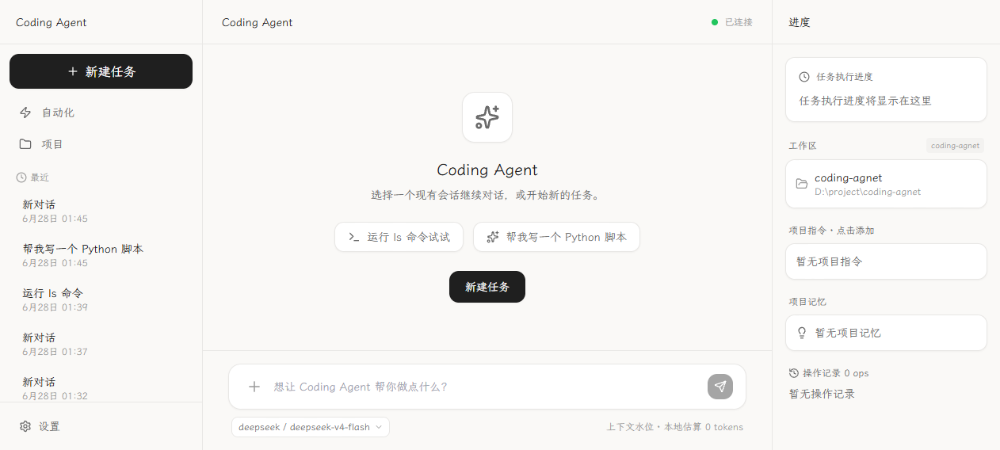
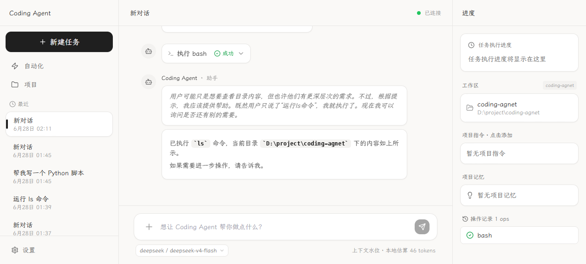

# Coding Agent

A lightweight, self-hosted coding assistant that runs in your terminal **and** your browser. Tell it what you want, and it will read files, run shell commands, edit code, search your project, and explain every step in real time.



## Why Coding Agent?

- **🔧 Real tools, real actions** — it can run `bash`, read/write/edit files, search code, and load project-specific skills.
- **⚡ Streaming, explainable output** — see the model's reasoning, tool calls, and live command output as they happen.
- **🖥️ Clean web UI** — one command starts both the gateway and the web interface; no separate terminal client needed.
- **💾 Persistent sessions** — conversations are saved locally as JSONL, so you can pick up where you left off.
- **🔒 Self-hosted** — your API key stays on your machine; everything runs locally.



## Quick start

### Install

```bash
uv tool install coding-agent
```

> Requires Python 3.14+. If you don't have `uv`, install it from [astral.sh/uv](https://astral.sh/uv).

### Configure

Create `~/.coding-agent/settings.json`:

```json
{
  "selectedModel": "deepseek/deepseek-v4-flash",
  "providers": {
    "deepseek": {
      "baseUrl": "https://api.deepseek.com/v1",
      "apiKey": "sk-xxx",
      "models": [
        {
          "id": "deepseek-v4-flash",
          "name": "DeepSeek V4 Flash",
          "contextWindow": 1000000,
          "maxTokens": 384000
        }
      ]
    }
  },
  "max_turns": 25
}
```

### Run

```bash
coding-agent --web
```

Open [http://127.0.0.1:8080](http://127.0.0.1:8080) and start typing.

## Built-in tools

| Tool | What it does |
|------|--------------|
| `bash` | Execute shell commands and capture output |
| `read` | Read any file in your project |
| `write` | Create or overwrite files |
| `edit` | Make precise text replacements |
| `search` | Search file contents with regex |
| `list_dir` | List directory contents |
| `load_skill` | Load a project or user skill from a `SKILL.md` |

## Development

Want to hack on it? See [docs/development.md](docs/development.md) for the architecture, local setup, and contribution workflow.

## Documentation

- [Development guide](docs/development.md)
- [Gateway protocol](docs/protocol.md)
- [Original proposal](docs/proposal.md)

## License

MIT
